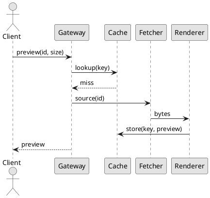

# Thumbnail Service

The thumbnail service turns uploaded images into a fixed set of preview sizes.
A request names a source image and a size; if that preview has been generated
before it is served from cache, and otherwise it is rendered on demand and
stored. Nothing is generated ahead of time, so adding a new size costs nothing
until someone asks for it.

## Overview

A render is pure: the same source bytes and the same size always produce the
same output, so a preview can be regenerated at any point and thrown away
whenever the cache is under pressure. Workers pull from a single queue and do
not talk to each other.

- A source image is fetched once and reused for every size in the request.
- Renders are cancelled if the caller disconnects before they finish.
- A failed render is retried twice, then cached as a failure for a short while.
- Animated sources produce a still preview taken from the first frame.

## Configuration

Settings are read once at startup and cannot be changed while the process is
running. A malformed value fails the boot rather than falling back to a default,
so a typo surfaces immediately instead of quietly changing behaviour in
production.

| Setting | Type | Default | Applies to | Notes |
|---------|------|---------|------------|-------|
| `max_width` | integer | `2048` | renderer | Larger requests are clamped |
| `jpeg_quality` | integer | `82` | renderer | Ignored for lossless output |
| `cache_ttl` | duration | `30d` | cache | Previews expire after this |
| `worker_threads` | integer | `4` | renderer | Defaults to the core count |
| `queue_depth` | integer | `512` | queue | Requests rejected beyond this |
| `max_source_bytes` | integer | `26214400` | fetcher | Sources above this are refused |
| `fetch_timeout_ms` | integer | `3000` | fetcher | Per-attempt, not total |
| `metrics_port` | integer | `9090` | process | Prometheus scrape endpoint |
| `shutdown_grace` | duration | `30s` | process | Time to drain in-flight renders |
| `storage_backend` | string | `disk` | cache | One of `disk` or `s3` |
| `retry_budget` | integer | `2` | fetcher | Attempts after the first failure |
| `prefetch_window` | integer | `8` | queue | Sources fetched ahead of render |

### Environment

Every setting can be overridden by an environment variable with the `THUMBS_`
prefix. The variable wins over the file, which makes it possible to change one
value in a container without rebuilding the image.

```bash
# widen the clamp and soften compression for print previews
export THUMBS_MAX_WIDTH=4096
export THUMBS_JPEG_QUALITY=90
# four workers is plenty for a single node
export THUMBS_WORKER_THREADS=4
thumbs serve --config /etc/thumbs/config.toml
```

## Architecture

A request travels through four components. The gateway validates the size and
resolves the source, the cache is consulted for an existing preview, the fetcher
retrieves source bytes when there is a miss, and the renderer produces the
preview. Only the cache is stateful in the request path.



### Cache keys

A key is derived from the source identifier, its content hash, and the requested
size. Including the content hash means a replaced source produces a different
key, so a stale preview is never served and no explicit invalidation step is
needed when an image is overwritten.

> [!NOTE]
> A cached failure uses the same key shape as a cached preview, with a short
> expiry. This keeps a broken source from being refetched on every request
> without hiding a fix for longer than a few minutes.

## Operations

Current release status: :status[Stable]{color=green}. Routine operations are
covered by the runbook; anything that clears the cache wholesale should be done
with a maintainer present. See the [capacity guide](capacity.md) for sizing
guidance.

::::tabs

:::tab[Health check]

A node reports ready once its queue is attached and the cache directory is
writable. Readiness is not the same as liveness: a node whose queue is full
stays live but stops accepting new work.

:::

:::tab[Draining]

Draining stops accepting requests, waits for in-flight renders, and then closes
the queue. A drain that exceeds the grace period is escalated to an abort, which
is safe because an unfinished render was never cached.

:::

::::

## Limits

The service is designed for many small previews rather than few large ones. A
source above the size limit is refused outright rather than downsampled first,
because downsampling would consume the memory the limit exists to protect.

- One preview size per request; batch requests are split by the gateway.
- Cached previews are immutable and are replaced only by expiry.
