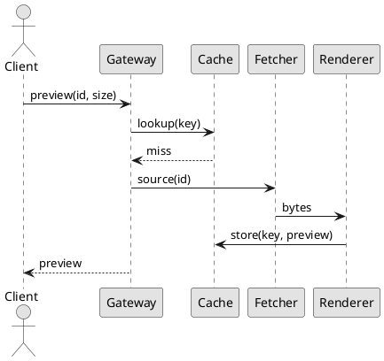

# Thumbs: сервис превью изображений

Сервис превращает загруженные изображения в фиксированный набор размеров
превью. Запрос называет исходное изображение и размер; если такое превью уже
生成过, оно отдаётся из кэша, иначе рендерится по требованию и сохраняется.
Ничего не готовится заранее, поэтому новый размер ничего не стоит, пока его
никто не запросил.

## Обзор: как это устроено

Рендер чистый: одни и те же исходные байты и один и тот же размер всегда дают
одинаковый результат, поэтому превью можно перегенерировать в любой момент и
выбросить, когда кэш под давлением. Workers разбирают одну очередь и не
общаются между собой.

- Исходник забирается один раз и переиспользуется для всех размеров запроса.
- Рендер отменяется, если клиент отключился раньше, чем тот завершился.
- Упавший рендер повторяется дважды, затем ошибка ненадолго кэшируется.
- Анимированные исходники дают статичное превью по первому кадру.

## Конфигурация сервиса

Настройки читаются один раз при старте и не меняются во время работы процесса.
Некорректное значение останавливает boot, а не подменяется значением по
умолчанию, поэтому опечатка видна сразу, а не меняет поведение в production.

| Настройка | Тип | Умолчание | Область | Примечание |
|-----------|------|---------|------------|------------|
| `max_width` | integer | `2048` | renderer | Большие запросы обрезаются |
| `jpeg_quality` | integer | `82` | renderer | Не влияет на lossless |
| `cache_ttl` | duration | `30d` | cache | Через столько превью истекает |
| `worker_threads` | integer | `4` | renderer | По умолчанию — число ядер |
| `queue_depth` | integer | `512` | queue | Сверх этого запросы отклоняются |
| `max_source_bytes` | integer | `26214400` | fetcher | Больше — отказ |
| `fetch_timeout_ms` | integer | `3000` | fetcher | На попытку, не суммарно |
| `metrics_port` | integer | `9090` | процесс | Точка сбора метрик Prometheus |
| `shutdown_grace` | duration | `30s` | процесс | Время на слив активных рендеров |
| `storage_backend` | string | `disk` | cache | Либо `disk`, либо `s3` |
| `retry_budget` | integer | `2` | fetcher | Попыток после первой неудачи |
| `prefetch_window` | integer | `8` | queue | Исходников читается наперёд |

### Переменные окружения

Любую настройку можно переопределить переменной окружения с префиксом `THUMBS_`.
Переменная важнее файла: это позволяет поменять одно значение в контейнере, не
пересобирая image.

```bash
# шире обрезка и мягче сжатие для печатных превью
export THUMBS_MAX_WIDTH=4096
export THUMBS_JPEG_QUALITY=90
# четырёх воркеров хватает одному узлу
export THUMBS_WORKER_THREADS=4
thumbs serve --config /etc/thumbs/config.toml
```

## Архитектура и путь запроса

Запрос проходит через четыре компонента. Gateway проверяет размер и определяет
исходник, cache проверяется на готовое превью, fetcher забирает байты при
промахе, а renderer готовит превью. Состояние в пути запроса держит только
cache.



### 缓存键 (cache keys)

Ключ выводится из идентификатора исходника, хэша его содержимого и запрошенного
размера. 包含内容哈希意味着被替换的源会产生不同的键，因此永远不会返回过期的预览，
覆盖图片时也不需要显式的失效步骤。

> [!NOTE]
> Закэшированная ошибка использует ту же форму ключа, что и превью, но с
> коротким сроком. Это не даёт перезапрашивать сломанный исходник на каждый
> запрос и при этом не прячет починку дольше нескольких минут.

## Эксплуатация и дежурство

Текущий статус релиза: :status[Стабильно]{color=green}. Рутинные операции
описаны в регламенте; всё, что чистит кэш целиком, стоит делать вместе с
maintainer. Рекомендации по размеру — в [руководстве по
ёмкости](capacity.md).

:::tab[Health check]

Узел сообщает о readiness, когда очередь подключена, а каталог кэша доступен на
запись. Readiness — не то же самое, что liveness: узел с полной очередью
остаётся живым, но перестаёт брать работу.

:::tab[Draining]

Draining прекращает приём запросов, дожидается активных рендеров и закрывает
очередь. Если он не уложился в grace period, он переходит в abort — это
безопасно, поскольку незавершённый рендер никогда не попадал в кэш.

:::

## Limites et contraintes

Le service est conçu pour de nombreuses petites vignettes plutôt que pour
quelques grandes. Une source dépassant `max_source_bytes` est refusée telle
quelle, sans réduction préalable : réduire consommerait la mémoire que la limite
existe précisément pour protéger.

- Une seule taille par requête ; les lots sont découpés par la gateway.
- Les vignettes en cache sont immuables et ne changent qu'à l'expiration.
