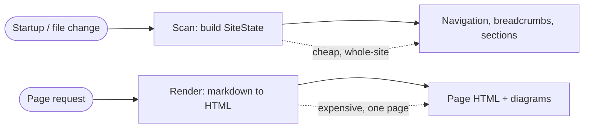
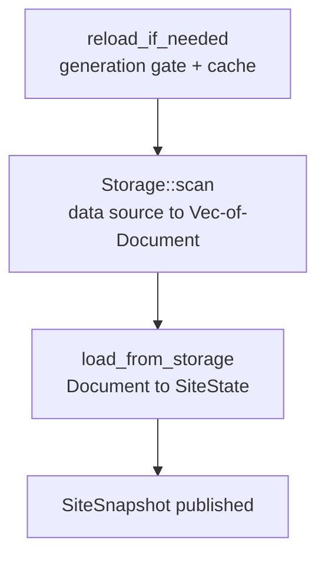
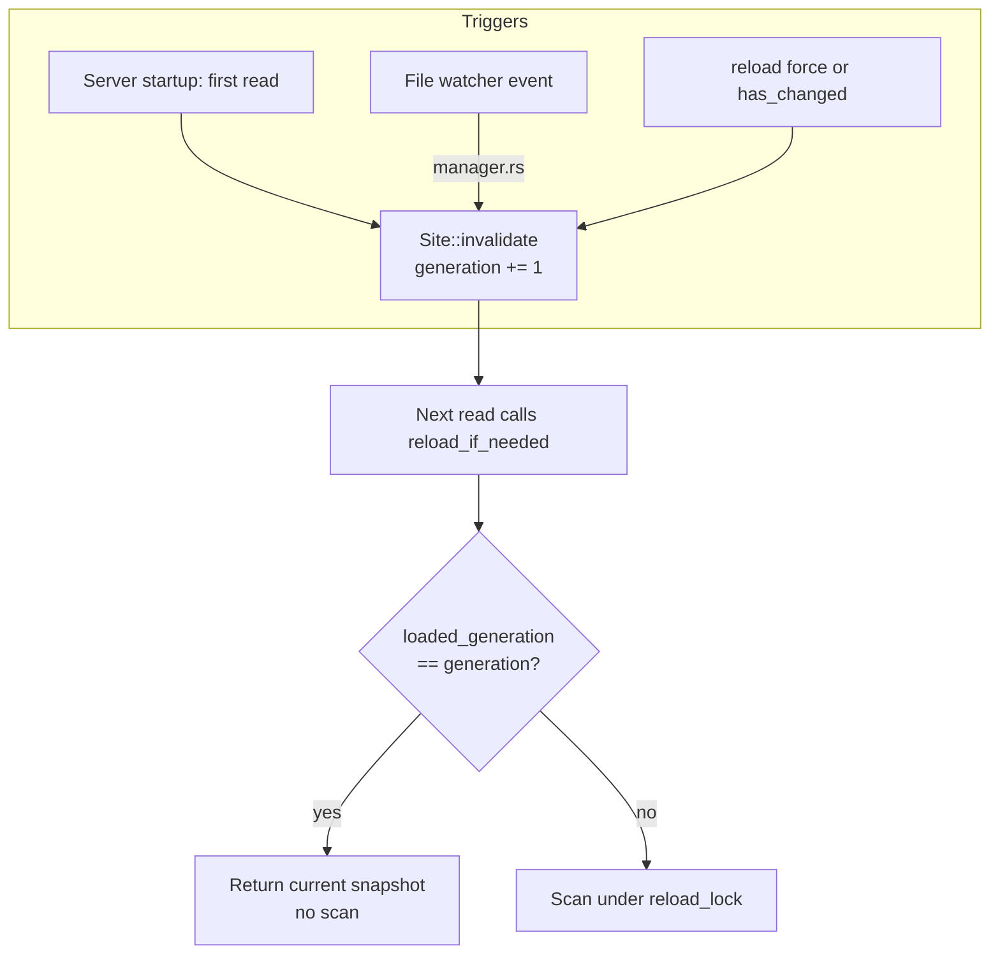
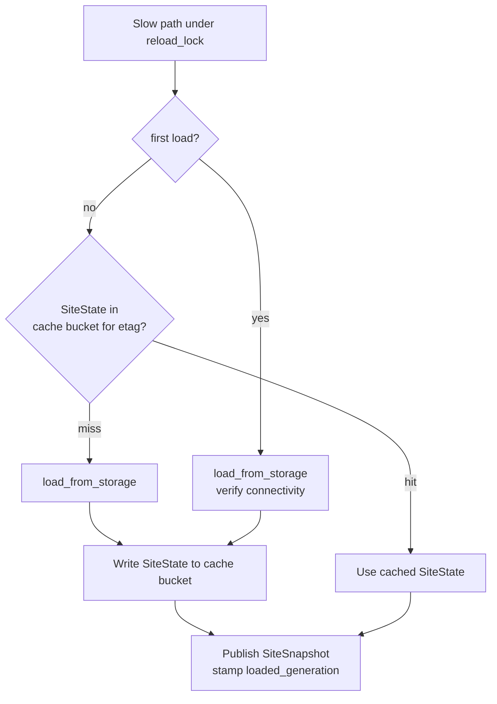
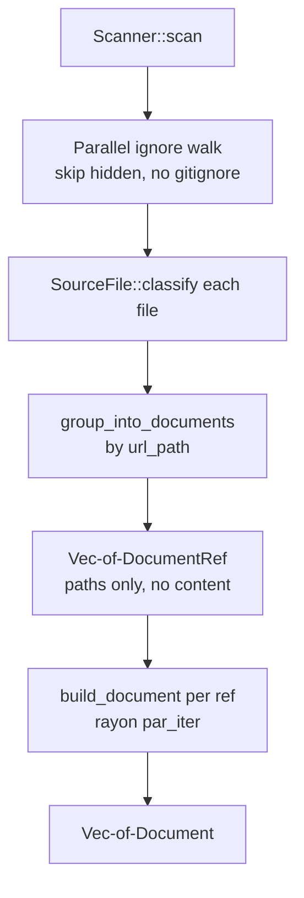
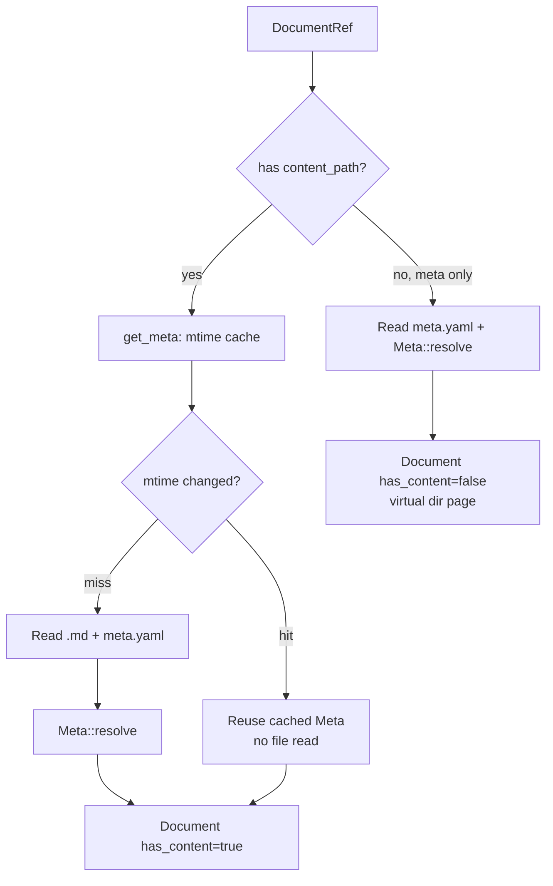
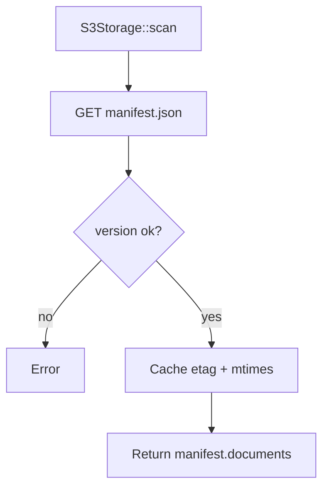
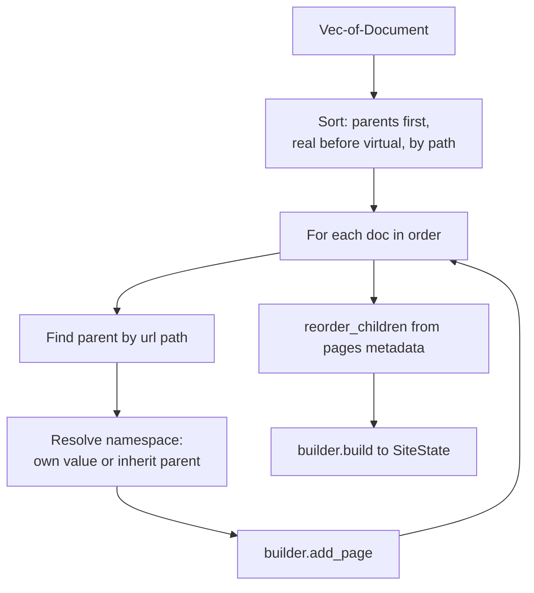

# Scan Process

How RW turns a directory of markdown files (or an S3 bundle) into a navigable
site structure — end to end.

## The guiding principle

RW splits its work into two stages with very different budgets:

- **Scan time** — build the `SiteState` (the navigation tree) so the browser can
  render the sidebar, breadcrumbs, and section grouping. This must be **fast**
  and runs on startup and on every file change. It reads only the *minimum*
  needed for navigation.
- **Request time** — render one page to HTML on demand (full markdown parse,
  syntax highlighting, ToC, Kroki diagrams, inherited page metadata). This is
  where the expensive work lives, and it is cached per page.

This document covers **scan time** only. The key rule: scanning never renders
markdown bodies and never contacts Kroki. It extracts just enough metadata
(title, kind, namespace, `pages` order) to place each page in the tree.

## High-level pipeline

Three stages sit between a trigger and a fresh `SiteState`. The middle stage
(`Storage::scan`) is the only one that touches the data source, and it has two
implementations (filesystem and S3).

- **`reload_if_needed`** — `rw-site/src/site.rs`. Decides *whether* to scan.
- **`Storage::scan`** — `rw-storage-fs` or `rw-storage-s3`. Produces `Vec<Document>`.
- **`load_from_storage`** — `rw-site/src/site.rs`. Assembles the tree.

Each stage is detailed below.

---

## Stage 0 — What triggers a scan

A scan is never run eagerly. It is gated by a monotonic **generation counter**.
`invalidate()` bumps the counter; the next *read* notices the counter moved and
re-scans.

- Reads (`render`, `navigation`, `list_sections`, …) all call `reload_if_needed`
  first — see the many call sites in `rw-site/src/site.rs`.
- The file watcher (`rw-server/src/live_reload/manager.rs`) calls
  `site.invalidate()` on create/modify/delete events. It does **not** scan
  itself — it just marks the structure stale so the next request re-scans.
- The gate is lock-free on the fast path; only a genuine reload takes
  `reload_lock`, so concurrent requests don't each trigger a scan.

**Data read at this stage:** none. Only atomic counters.

---

## Stage 1 — `reload_if_needed`: decide and cache

Once the generation gate says "stale", this stage decides where the fresh
`SiteState` comes from: the **site cache bucket** or a real storage scan.

- The cache **etag** is just the generation number (`pre_scan.to_string()`).
- The **site cache bucket** stores a serialized `SiteState` keyed by etag
  (`SiteState::from_cache` / `to_cache`). This lets a second `RwSite` instance
  (or a restart with a warm bucket) skip the storage walk entirely.
- **First load skips the cache** deliberately, to surface storage connectivity
  errors instead of masking them.
- On scan **failure**, the previous snapshot is kept ("keep stale data") rather
  than blanking the site.

**Data read at this stage:** possibly a serialized `SiteState` from the cache
bucket (file cache under `.rw/cache`, or S3 cache in embedded/Backstage mode).

---

## Stage 2 — `Storage::scan`: the data source → `Vec<Document>`

This is the only stage that reads the actual documentation source. It returns a
flat `Vec<Document>` — one lightweight record per page. Two backends implement
it.

A `Document` (`rw-storage/src/storage.rs`) carries only nav-relevant fields:

| Field | Meaning |
|-------|---------|
| `path` | URL path (`""`, `guide`, `domain/billing`) |
| `title` | Resolved title (metadata → H1 → filename) |
| `has_content` | Is there a real `.md` body? (false = virtual dir page) |
| `page_kind` | Section kind (`domain`, `guide`, …); triggers section detection |
| `namespace` | Section namespace declared by *this* page (not yet inherited) |
| `description` | Page description |
| `origin` | Source-dir prefix to strip from links (e.g. `docs`) |
| `pages` | Declared child order for the sidebar |
| `is_dir` | URL denotes a directory (index/README) vs a leaf file |

### Stage 2a — Filesystem backend (`rw-storage-fs`)

The filesystem scan is itself two phases: **discover** (walk, no content read)
then **build** (parallel, reads just enough).

**Phase 1 — discovery (`scanner.rs`, `source.rs`):**

- `WalkBuilder` walks `source_dir` in parallel (work-stealing, capped at 12
  threads), skipping hidden files. Git-ignore rules are **off**.
- Each file is classified by `classify_relpath` (`source.rs`) into:
  - `*.md` → **Content**, url path via `file_path_to_url`
  - `meta.yaml` (the configured `meta_filename`) → **Metadata** for the parent
    dir (rank `CanonicalDir`)
  - `index.meta.yaml` → directory metadata (rank `IndexDir`, with a warning)
  - `<name>.meta.yaml` → **sibling** metadata for `<name>` (rank `Sibling`)
- `group_into_documents` merges files sharing a `url_path` into one
  `DocumentRef { url_path, content_path?, meta_path? }`. Metadata collisions on
  one path are broken deterministically by `MetaRank` (lower wins), matching how
  `meta()` resolves at request time.

A `DocumentRef` holds **paths only** — no file has been opened yet.

**Phase 2 — build (`lib.rs::build_document`, run under `par_iter`):**

- `get_meta` consults an **mtime cache** (`mtime_cache`): if both the `.md` and
  its `meta.yaml` mtimes are unchanged since the last scan, the cached `Meta` is
  reused and **no file is read**. This is what keeps rescans on save cheap — only
  the changed file is re-parsed.
- On a cache miss, `Meta::resolve` (`rw-meta`) reads the files and does a
  *lightweight* parse via pulldown-cmark: extract YAML frontmatter + the first
  H1 only. It merges `meta.yaml` ← frontmatter and resolves the title as
  `frontmatter.title → meta.title → H1 → titlecased filename`.
- Namespace strings are **validated** here; an invalid `namespace` fails the
  scan with a path-tagged error.
- A `meta.yaml` with no sibling `.md` produces a **virtual** `Document`
  (`has_content = false`) — a directory/catalog node with a title but no body.
- The README homepage is injected as a root `Document` if no `index.md` produced
  one.

**Data read at this stage (FS):** the directory tree (names only during the
walk), then — only for changed pages — the `.md` frontmatter+H1 and its
`meta.yaml`. Never the full markdown body.

### Stage 2b — S3 backend (`rw-storage-s3`)

For deployed Backstage/embedded use, the "scan" is a single manifest fetch — all
`Document`s were computed at publish time and baked into `manifest.json`.

- `fetch_manifest` does one `GET manifest.json`, validates `FORMAT_VERSION`, and
  returns `manifest.documents` directly — no per-page work.
- The manifest **ETag** and per-page **mtimes** are cached so `has_changed()`
  (a cheap HEAD) and later `mtime()` calls don't refetch.
- There is no walk, no classification, no `Meta::resolve` — the publisher already
  ran the filesystem scan and serialized the result.

**Data read at this stage (S3):** one `manifest.json` object.

---

## Stage 3 — `load_from_storage`: `Document`s → `SiteState`

The flat `Vec<Document>` is assembled into the hierarchical `SiteState` that
backs navigation. This is pure in-memory work — no I/O.

- **Sort** guarantees each page's parent is processed before the page itself
  (`url_depth`, then content-before-virtual, then path). This makes namespace
  inheritance a single forward pass.
- **Namespace inheritance:** a page uses its own declared `namespace`, else
  inherits its parent's resolved namespace, else the default. Storage is
  contracted to hand over only validated namespaces (FS validated in
  `build_document`; S3 round-trips an already-validated value).
- **`SiteStateBuilder::add_page`** links the page to its parent, registers
  sections (when `page_kind` is set), and records the path index.
- **`reorder_children`** applies each directory's declared `pages` order to the
  sidebar; unlisted pages fall back to alphabetical.
- **`build()`** finalizes derived data: the `NavItem` tree, `sections` map,
  `subtree_has_content` (post-order DFS marking which branches hold real pages),
  the `root_namespace`, and a `resolution_fingerprint` — a hash of the
  cross-page inputs that page rendering depends on, later folded into the
  per-page render cache etag so editing one page busts the cache of pages that
  reference it.

The resulting `SiteState` is wrapped in a `SiteSnapshot`, published atomically,
and stamped with the generation it satisfies (Stage 1).

**Data read at this stage:** none. Purely a transform over `Vec<Document>`.

---

## What data comes from where — summary

| Step | Reads from | What |
|------|-----------|------|
| Stage 0 (trigger) | atomics | generation counter only |
| Stage 1 (cache) | cache bucket (`.rw/cache` or S3 cache) | serialized `SiteState` (etag = generation) |
| Stage 2a walk (FS) | filesystem | directory entries, file names — **no content** |
| Stage 2a build (FS) | filesystem (changed files only) | `.md` frontmatter + first H1, `meta.yaml` |
| Stage 2b (S3) | S3 | one `manifest.json` (all `Document`s pre-computed) |
| Stage 3 (assemble) | in-memory | transform `Vec<Document>` → `SiteState` |

## What scanning deliberately does **not** do

All of the following are deferred to **request time** (`rw-site/src/page.rs`,
`PageRenderer`), not scan time:

- Reading the full markdown body.
- Rendering markdown → HTML, syntax highlighting, ToC generation.
- Rendering diagrams via Kroki.
- Loading **inherited** page metadata (`Storage::meta` → the raw `Metadata`
  struct with directory inheritance). Note this is a *different* metadata path
  from the scan-time `Meta::resolve`: scan builds the merged nav view; request
  loads the raw inherited sidecar for the page being rendered.

## Type reference

| Type | Crate | Created at | Role |
|------|-------|-----------|------|
| `Meta` | `rw-meta` | **scan** (`build_document` → `get_meta` → `Meta::resolve`) | merged nav view: title, kind, namespace, pages |
| `Document` | `rw-storage` | **scan** (`Storage::scan`) | lightweight per-page nav record |
| `Metadata` | `rw-storage` | **request** (`PageRenderer` → `Storage::meta`) | raw sidecar + directory inheritance, for the rendered page |
| `SiteState` | `rw-site` | **scan** (`load_from_storage` → `SiteStateBuilder::build`) | the assembled navigation tree |
