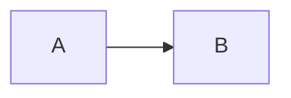

# Diagram Rendering

RW renders diagrams in fenced code blocks via [Kroki](https://kroki.io). Diagrams are written inline in markdown using fenced code blocks with the diagram language as the language identifier. Kroki processes the diagram source and returns rendered output that is embedded directly into the page.

## Supported Formats

RW supports PlantUML, Mermaid, GraphViz, and 14+ other formats supported by Kroki. Any diagram language supported by your Kroki instance can be used as the code block language identifier.

## Configuration

Add a `[diagrams]` section to your `rw.toml`:

```toml
[diagrams]
kroki_url = "https://kroki.io"  # Kroki server URL (required)
include_dirs = ["."]            # PlantUML !include search paths
dpi = 192                       # DPI for diagrams (default: 192, retina)
```

- **`kroki_url`** -- URL of the Kroki server. Required when the `[diagrams]` section is present.
- **`include_dirs`** -- Directories to search when resolving PlantUML `!include` directives.
- **`dpi`** -- DPI for rendered diagrams. The default of 192 produces retina-quality output.

## Usage

Use fenced code blocks with the diagram language as the identifier:

````markdown
```plantuml
Alice -> Bob: Hello
Bob -> Alice: Hi
```


````

The diagram source is sent to the Kroki server, rendered, and embedded into the page as an SVG.

## PlantUML Includes

PlantUML `!include` directives are resolved relative to the paths listed in `include_dirs`. This allows sharing common definitions, themes, and macros across multiple diagrams.

For example, with `include_dirs = ["common"]`, a diagram can reference shared definitions:

```plantuml
!include common-styles.iuml

Alice -> Bob: Hello
```

The file `common/common-styles.iuml` will be found and included before rendering.

## Rendering

Diagrams are rendered server-side via Kroki and embedded as SVGs. Key details:

- The default DPI of 192 produces retina-quality output suitable for high-resolution displays.
- PlantUML diagrams use the Roboto font by default (`skinparam defaultFontName Roboto`).
- Rendering is performed in parallel for pages with multiple diagrams.
- Rendered diagrams are cached to avoid redundant requests to the Kroki server.
